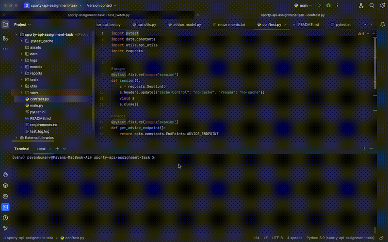

# Sporty Group – API Test Automation (AdviceSlip API)

## Overview
Automated API tests for the [AdviceSlip API](https://api.adviceslip.com), built using **Python**, **Pytest**, and **Pydantic**.  
The framework validates API responses, schema correctness, and error handling.

---

## How to Run

- Ensure python is available is available in the system.

```bash
# 1. Clone repo
git clone https://github.com/pavanmadrid88/advice-api-test-automation.git
cd advice-api-test-automation

# 2. Create virtual environment
python -m venv venv
source venv/bin/activate     # Linux/Mac
venv\Scripts\activate        # Windows

# 3. Install dependencies
pip install -r requirements.txt

# 4. Run all tests
pytest
```

## Notes

- The framework follows a modular design, separating test logic, utilities, data, and configuration for better maintainability.
- Base URLs, endpoints, and environment-specific values are centralized in the **data/constants.p**y file for consistency.
- A custom **APIClient** wrapper around requests simplifies REST calls, manages sessions, and enforces standardized timeout / base URL handling across all tests.
- Response schema validation is implemented using **Pydantic** models to ensure API responses conform to expected data structures and types.
- The framework uses a **pytest.ini** file to maintain common test configurations such as default options, test paths, and custom markers.
- **Parallel execution** is enabled via the **pytest-xdist** plugin using the **-n** option.
- **Logs** are written and stored under **logs** directory.
- **HTML reporting**: handled by the **pytest-html** plugin, with reports stored in the **/reports** folder.

---

## Folder Structure

```
data/           → API constants
logs/           → Store execution logs
reports/        → pytest-html report
models/         → Pydantic response models
tests/          → API test cases
utils/          → Logger ,api_client and schema validation utilities
conftest.py     → Shared pytest fixtures
pytest.ini      → Common test configuration with default options set
requirements.txt
readme.md
```

---

## Test Cases

- Below test cases are covered as of now from **/advice** Service.
- Reference : [Advice Slip JSON API](https://api.adviceslip.com/)

| Test Name                | Endpoint                  | Purpose                                                            |
|---------------------------|----------------------------|--------------------------------------------------------------------|
| `test_get_advice_random`  | `/advice`                 | Validate random advice response                                    |
| `test_get_advice_by_id`   | `/advice/{id}`            | Verify advice by specific ID (parameterised).                      |
| `test_search_advice`      | `/advice/search/{query}`  | Ensure each advice contains the search query term (parameterised). |
| `test_invalid_advice`     | `/advice/{invalid_id}`    | Validate error response in case of invalid ID                      |

---

## Tools Used
- **Python 3.x**
- **Pytest** – test runner  
- **Requests** – HTTP client  
- **Pydantic** – response validation  
- **Logging** – console + file output  

---

## Test Run Demo


